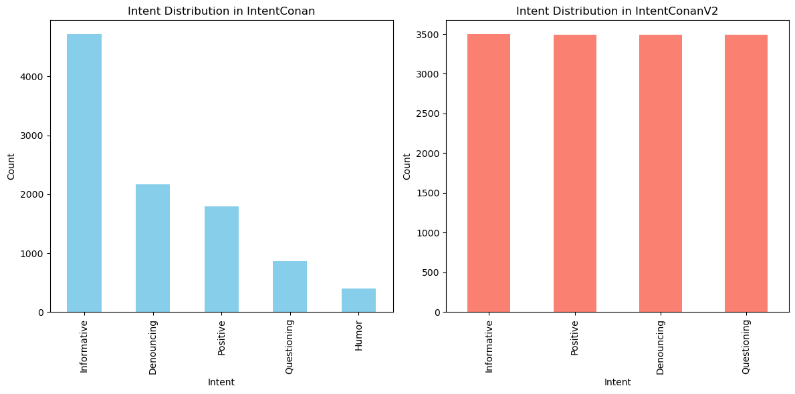
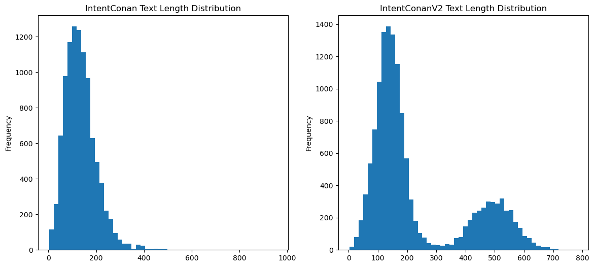
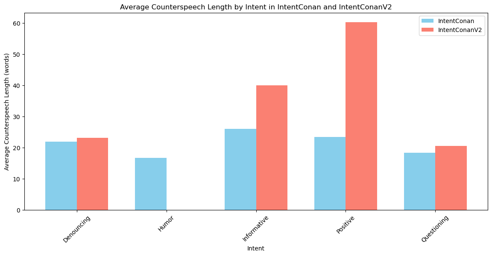
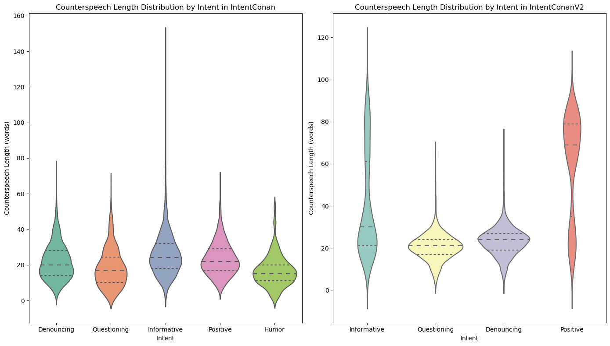
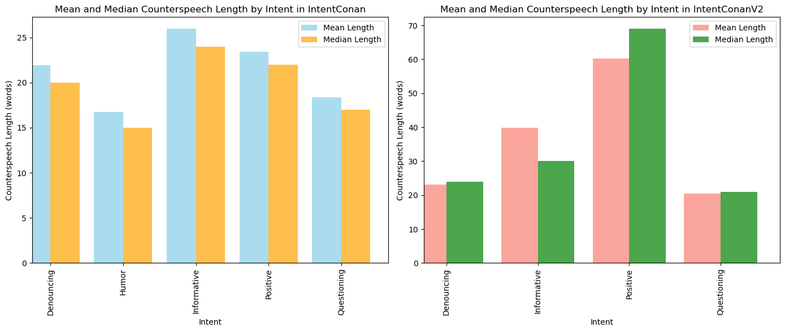
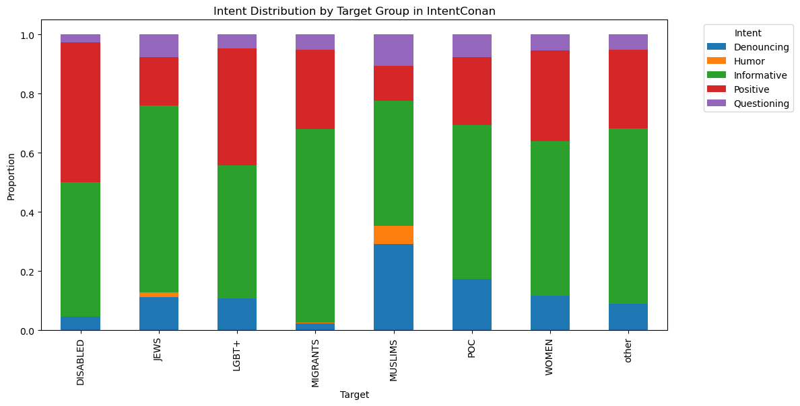
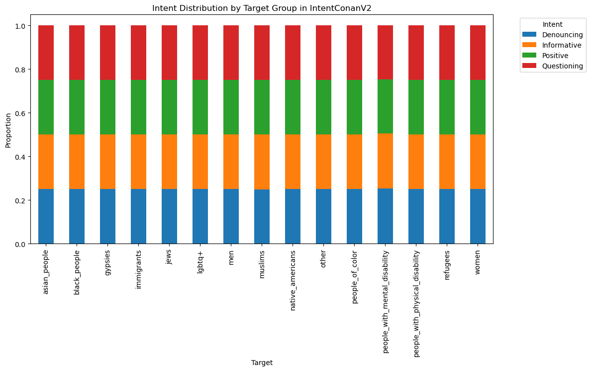
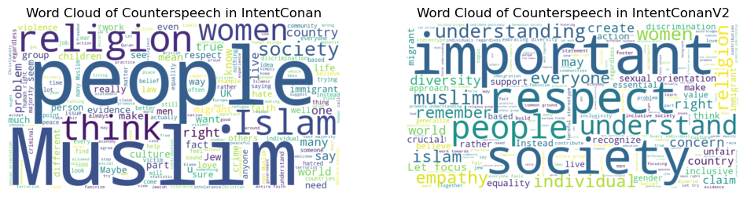

# IntentConan and IntentConanV2 Dataset Analysis

This repository contains the code and analysis for understanding the IntentConan and IntentConanV2 datasets, with a focus on intent-conditioned counterspeech generation. The analysis aims to explore various aspects of the datasets, including intent distribution, text length, target group distribution etc.

## Table of Contents

- [Introduction](#introduction)
- [Dataset Overview](#dataset-overview)
- [Analysis Summary](#analysis-summary)
  - [1. Intent Distribution Analysis](#1-intent-distribution-analysis)
  - [2. Text Length Analysis](#2-text-length-analysis)
  - [3. Intent-wise Counterspeech Length Analysis](#3-intent-wise-counterspeech-length-analysis)
  - [4. Intent-wise Counterspeech Length Analysis Part 2](#4-intent-wise-counterspeech-length-analysis-part-2)
  - [5. Intent Distribution by Target Group](#5-intent-distribution-by-target-group)
  - [6. Wordcloud of Counterspeech](#6-wordcloud-of-counterspeech)
- [How to Run the Code](#how-to-run-the-code)
- [Contributing](#contributing)
- [License](#license)

## Introduction

This project focuses on analyzing the IntentConan and IntentConanV2 datasets, which support the development of models for intent-conditioned counterspeech generation. The datasets contain examples of hate speech and corresponding counterspeech, annotated with various intents/counterspeech strategies.

## Dataset Overview

- **IntentConan**: The original dataset includes counterspeech examples categorized into intents such as positive, informative, questioning, denouncing, and humour.
- **IntentConanV2**: An expanded version of the original dataset, IntentConanV2 refines the intent categories and improves upon the quality and distribution of counterspeech examples. It includes counterspeech examples categorized into intents such as positive, informative, questioning, and denouncing. (Excludes humour).

## Analysis Summary

### 1. Intent Distribution Analysis

This analysis visualizes the distribution of intents within the datasets to identify any potential imbalances.

**Visualizations:**



### 2. Text Length Analysis

I analyze the length of the texts in the datasets to understand the variability and range of counterspeech lengths.

**Visualizations:**



### 3. Intent-wise Counterspeech Length Analysis

This analysis compares the average counterspeech length for each intent across both datasets.

**Visualizations:**



### 4. Intent-wise Counterspeech Length Analysis Part 2

Further analysis of counterspeech length distributions, including violin plots for a detailed view of the distribution, and bar charts comparing mean vs. median lengths.

**Visualizations:**

- **Violin Plots:** Distribution of counterspeech lengths by intent for both datasets.



- **Bar Charts:** Mean vs. median counterspeech lengths for each intent in both datasets.



### 5. Intent Distribution by Target Group

This analysis examines how different intents are distributed across various target groups within the datasets.

**Visualizations:**




### 6. Wordcloud of Counterspeech

Wordclouds visualize the most frequent terms used in counterspeech across both datasets.

**Visualizations:**

- **Wordclouds:** Wordclouds for counterspeech in IntentConan and IntentConanV2.



## How to Run the Code

1. Clone the repository:
   ```bash
   git clone https://github.com/aashimaparvathi/counter-speech-intent-analysis.git
   ```

## Citations

- **IntentConan**:

  > Rishabh Gupta, Shaily Desai, Manvi Goel, Anil Bandhkavi, Tanmoy Chakraborty, and Md Shad Akhtar. Counterspeeches up my sleeve! Intent Distribution Learning and Persistent Fusion for Intent-Conditioned Counterspeech Generation.

- **IntentConanV2**:
  > Amey Hengle, Aswini Kumar, Sahajpreet Singh, Anil Bandhakavi, Md Shad Akhtar, and Tanmoy Chakroborty. Intent-conditioned and Non-toxic Counterspeech Generation using Multi-Task Instruction Tuning with RLAIF.

## License

This project is licensed under the Creative Commons Attribution 4.0 International (CC BY 4.0) License. Please cite this repository if you use any part of this code or visualizations.

Full License Text: [Creative Commons Attribution 4.0 International License](https://creativecommons.org/licenses/by/4.0/legalcode)
